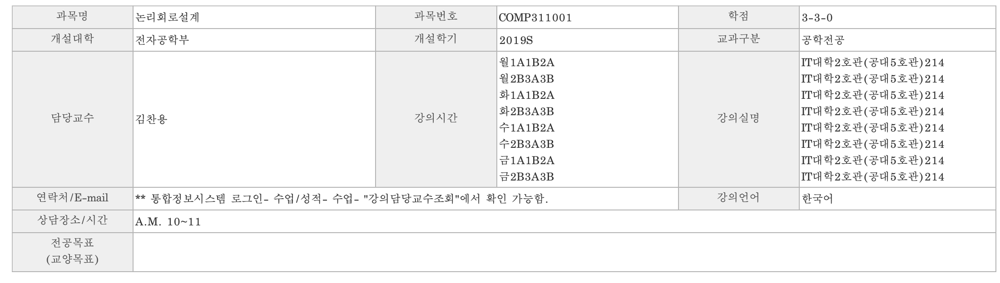
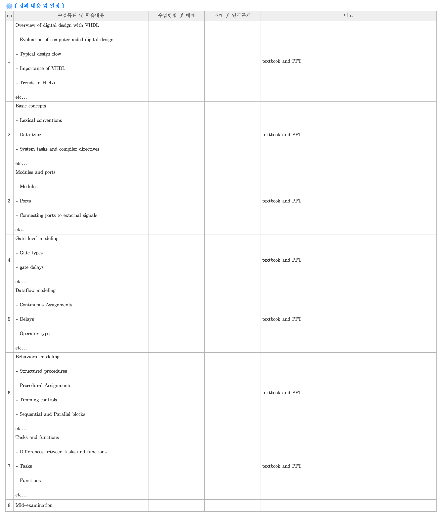
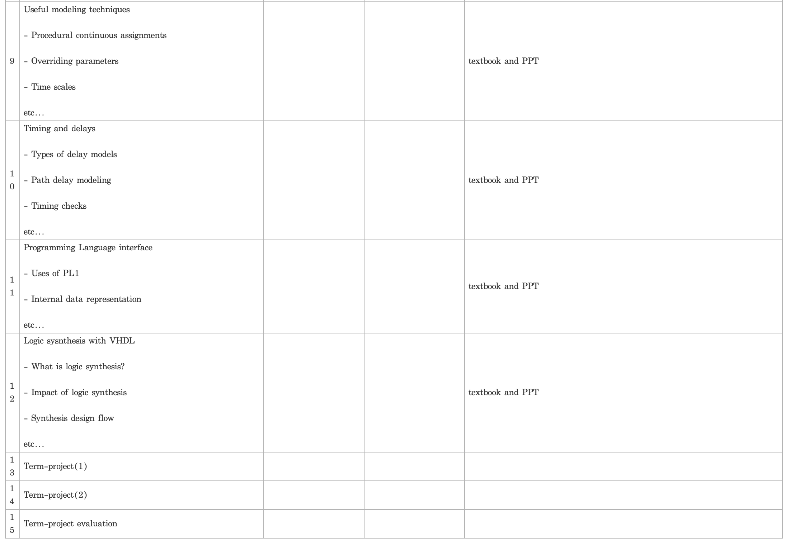

# 2019년도 여름학기 : 논리회로설계 (COMP311001)

본 자료는 경북대학교 전자공학부 수업 중 2019년도 여름학기에 진행한 ‘김찬용’ 교수님의 ‘논리회로설계’ 과목에 대한 정리이다.

상단의 폴더를 클릭하며 과제에 대한 설명과 해결 과정을 확인할 수 있다.

아래의 표는 이 과목이 어떤 식으로 진행이 되었는지에 대한 강의계획서이다.

# **Ⅰ. 프로젝트 결과**

**sel = ‘0000’ (Y <= A), sel = ‘0001’ (Y<= A+1)**

**sel = ‘0010’ (Y <= A+B), sel = ‘0011’ (Y<= A-1)**

**sel = ‘0100’ (Y <= A and B), sel = ‘0101’ (Y<= A or B)**

**sel = ‘0110’ (Y <= A xor B), sel = ‘0111’ (Y<= not(A))**

**sel = ‘1000’ (Y <= A), sel = ‘1001’ (Y<= shl A)**

**sel = ‘1010’ (Y <= shr A), sel = ‘1011’ (Y<= 0)**

**sel = ‘1100’ (Y <= A), sel = ‘1101’ (Y<= shl A)**

**sel = ‘1110’ (Y <= shr A), sel = ‘1111’ (Y<= 0)**

프로젝트의 목표인 12가지의 기능을 가진 산술논리 연산장치을 구현하고 결과를 출력하였다.

sel 에 총 4비트를 사용하고 있고, 산술 장치일 때, 논리 장치일 때, 쉬프터 장치일 때로 3가지의 상황을 나타내고 있으므로 쉬프터 장치는sel(3) 이 1이며, sel(2) 가 돈케어 일 때 작동하도록 설계하였다.

사진으로 나타낸 실험결과를 표로 나타내면 다음과 같고, 정상적으로 작동되었음을 확인하였다.

**※ 입력 및 출력부분에서 2진수를 10진수로 나타냈을 때, unsigned 으로 간주하고 보수를 취하지 않았음.**

# Ⅱ. 프로젝트 목적, 접근방법 및 세부결과

이 프로젝트를 수행하기 위해선, 수행해야 하는 과정을 여러부분으로 나눠서 생각할 필요가 있다.

① 목적확인, ② 엔티티 관리, ③ 아키텍쳐 관리, ④ 결과 도출

**① 목적확인**

이 프로젝트의 목적은 산술논리 연산장치 (ALU)를 설계하는 것이다.

왼쪽 그림과 같이 산술 장치, 논리 장치, 쉬프터 장치를 구현을 해야 한다. 총 12가지의 기능을 구현을 해야하므로 적절한MUX를 선택하는 것이 중요하다. 만약, 3비트 MUX를 선택한다면, 8가지의 경우를 표현하므로 부족하고 4비트 MUX를 선택한다면 16가지의 경우를 표현하므로 충분하게 된다.

따라서 4비트 MUX를 sel 으로 사용하고 각각의 기능을 부여하고, 나머지 남는 4가지 기능은 일괄적으로 무관항으로 처리해주면 된다.

**② 엔티티 관리**

엔티티에서는 설계할 부분의 입력과 출력 포트를 선언해주어야 한다. A와 B는 입력으로 들어가고 있고, Y 가 출력으로 나오고 있음을 확인할 수 있다. 추가적으로 4비트 MUX 또한 입력으로 설정해주어야 한다.

이 때, MUX 는 명확하게 4비트이므로 std_logic_vector를 사용하여 입력을 정의해주는 것이 편리하며, 이때 3 downto 0 으로 지정해준다. 그 이유는 비트의 경우, MSB 가 sel(3)을 나타내고 LSB가 sel(0)을 나타나게 하여야 하기 때문이다. A,B,Y 의 비트의 경우 여러 가지 비트를 지정할 수 있으나, 일반적인 마이크로프로세서에서 8비트를 사용하므로 8비트로 지정하였다. 이러한 엔티티를 선언하는 것은 하드웨어 외부의 입력 및 출력 인터페이스를 정의하는것이므로 가장 간단하지만 확실하게 부여해주어야 한다.

**③ 아키텍쳐 관리**

아키텍쳐에서는 설계할 부분에서 내부에서 실제로 동작하게 되는 구조를 잡아주는 것이다. 아키텍쳐에는 간단하게 병행문과 순차문으로 구별을 할 수 있으며, 적절한 출력을 얻어내기 위해 MUX를 사용하게 된다. 이는 조건문을 사용 해야한다는 것을 짐작하게 해주며, 조건문을 사용하기 위해서는 순차문(Process 문)을 사용하여야 한다.

처음으로 판단하게 될 것은 MUX 가 가르치는 방향에 따라 어떤 기능으로 동작할 것 인지를 정해주는 것이 필요하다. 3가지 장치에서, 각각 4가지 기능을 표현해야 하므로 sel(3:2) 으로 어떠한 장치로 사용할 것 인지 결정해주는 것이 편리하다. 따라서 sel(3:2) 가 00일 때 산술장치, 01일 때 논리장치, 10일 때 쉬프터장치로 사용되게 할 수 있으나, 11 일때의 경우도 쉬프터장치로 작동하도록 지정하여 sel(2) 와는 무관하게, 즉 sel(3) 이 1이 된다면 동일하게 작동하도록 설정하였다.

이제 어떠한 장치로 사용할것인지 설정을 했다면, 어떠한 기능으로 작동할것인지를 설정해주어야 한다.

가장 간단한 **논리 장치**부터 고려 해본다면 sel(1:0) 이 00 일 때 Y <= A and B, 01 일 때 Y <= A or B, 10 일 때 Y <= A xor B, 11 일 때 Y <= not(A)를 출력하도록 조건문을 사용해주면 된다.

sel(3:2)을 판단하는 if 문 내부에 sel(1:0)을 판단하는 if 문과 elsif 문들을 넣어서 코드를 작성할 수도 있지만, 같은 결과를 나타내고 시각적으로 편리하도록 case 문을 사용하였다.

**산술장치**의 경우 비트에 비트를 더하거나 빼는것이므로 전가산기와 반감산기를 구현해야 한다.

전가산기의 경우 A와 B와 캐리인을 입력받아 Sum과 캐리아웃을 출력시켜야 하고 전감산기의 경우 A와 B와 빌림인을 입력받아 Diff 와 빌림아웃을 출력시켜야 한다. 진리표를 나타내면 다음과 같다.

**전가산기 진리표**

**전감산기 진리표**

Sum = A xor B xor Cin

Cout = AB + ACin + BCin

Diff = A xor B xor Bin

Bout = A’B + A’Bin + BBin

이 때, A 와 B 는 총 8비트 이므로, A(7:0), B(7:0), Y(7:0)을 모두 나타나게 하기 위해서는 덧셈의 경우 전가산기 8개, 뺄셈의 경우 전감산기8개가 필요할 것이다.

sel(1:0) 이 00 일 때 Y <= A , 01 일 때 Y <= A + 1 이고, 10 일 때 Y <= A + B, 마지막으로 11 일 때 Y <= A – 1 이 되도록 설정하는 방법은 다음과 같다.

첫 번째로 Y <= A 가 되기 위해선, Y(7) <= A(7), Y(6) <= A(6),

, Y(0) <= A(0) 인 패턴으로 들어가며 된다.

두 번째로 Y <= A + 1 나 A + B 가 되기 위해선, 처음에 나오는 Sum(0) 가 Y(0) 이 되고, 첫 째 자리는 반가산기이므로, Cin을 0으로 준다. 즉Y(0) <= A(0) xor B(0) xor 0 이 되며, Cout(0) <= A(0)B(0) + A(0)0 + B(0)0 이 된다. B(7:1) 은 0으로 주고, B(0)을 1로 준다면, A+1 이 될 것이며, 임의의 B(7:0)을 준다면 A+B가 된다.

계속 이어서, Sum(1) 가 Y(1) 이 되므로, Y(1) <= A(1) xor B(1) xor Cout(0) 이 되며, Cout(1) <= A(1)B(1) + A(1)Cout(0) + B(1)Cout(0) 이 된다. 이러한 패턴으로 마지막 Y(7) 까지 얻을 수 있다.

세 번째로 Y <= A – 1 이 되기 위해선 전가산기와 동일한 방식으로, Diff(0) 가 Y(0) 이 되고, 첫 째 자리는 반감산기 이므로 Bin을 0으로 준다. Y(0) <= A(0) xor B(0) xor 0 이 되며, Bout(0) <= A’(0)B(0) + A’(0)0 + B(0)0 이 된다. 여기서는 B는 00000001 로 고정시키면 되며 Bout(0)을 Bin 에 넣으면서 8개의 비트를 처리해주면 된다.

하지만 이러한 방식으로 코드를 짜게 된다면 가독성이 떨어지게 되므로, 구조적 표현으로 하나의 설계된 부품으로 지정한다음 입력포트와 출력포트를 이어서 짜는게 더욱더 편리하다. 혹은 시각적으로 간편한 스케메틱을 이용해도 된다.

더욱더 편리한 방법을 찾기 위해 stackoverflow 커뮤니티에서 얻은 정보에 따르면,

use IEEE.STD_LOGIC_UNSIGNED.ALL; 를 선언하게 된다면 기존에 integer 으로 밖에 연산하지 못했던 상황을 비트에서 연산이 되도록 기능을 확장해 줄 수 있다. 따라서 실제로 코드를 작성할 때에는 std_logic_unsigned를 선언하여 간단하게 코드를 작성하였다. 해당 패키지 파일을 개봉해본 결과, 부울대수에서 연산자에 대해 사용자가 쉽게 사용할 수 있도록 함수가 선언되어 있었다.

마지막으로 **쉬프터 장치**를 만들기 위해서는 함수를 만들어서 하는 방법도 있지만, 가장 간단하게 바라봤을 때 A를 left shift를 하기 위해선 Y(7) <= A(6), Y(6) <= A(5),

Y(5) <= A(4), Y(4) <= A(3), Y(3) <= A(2), Y(2) <= A(1)

,Y(1) <= A(0), Y(0) <= A(7)을 결과로 나타내면 된다.

이와 같은 방식으로 A를 right shift 하기 위해선 Y(7) <= A(0), Y(6) <= A(7), Y(5) <= A(6), Y(4) <= A(5),

Y(3) <= A(4), Y(2) <= A(3), Y(1) <= A(2), Y(0) <= A(1)을 결과로 나타내면 된다.

또 다른 방법으로는 sll, srl 연산자를 사용하는 방법이 있다.

stackoverflow 커뮤니티에서 얻은 정보에 따르면, 가장 직관적으로 나타나기 위해서는 left shift 의 경우 y <= a(6 downto 0) & a(7) 으로, right shift 의 경우 y <= a(0) & a (7 downto 1) 으로 나타낼 수 있다.

**④ 결과도출**

엔티티와 아키텍쳐를 설정했으면, 실제로 맞게 동작하는지 테스트 벤치를 실시해야 한다. A와 B의 입력을 4개로 잡고, 각각의 시간을 1ns 로 설정하였다, 따라서 A와 B는 4ns 주기로 반복이 될 것이다. 4ns 주기로 sel(3:0)을 0000에서 1111까지 하나하나 증가시킨다면, 모든 상황을 비교해 볼 수 있게 된다. 다음은 실제로 테스트 벤치에서 입력한 신호이다.

pro1 : process

begin

a <= "00000001"; wait for 1ns; -- 1

a <= "00000011"; wait for 1ns; -- 3

a <= "00000101"; wait for 1ns; -- 5

a <= "00000111"; wait for 1ns; -- 7

end process pro1;

pro2 : process

begin

b <= "00000010"; wait for 1ns; -- 2

b <= "00000100"; wait for 1ns; -- 4

b <= "00000110"; wait for 1ns; -- 6

b <= "00001000"; wait for 1ns; -- 8

end process pro2;

pro3 : process

begin

sel <= "0000"; wait for 4ns;

sel <= "0001"; wait for 4ns;

sel <= "0010"; wait for 4ns;

sel <= "0011"; wait for 4ns;

sel <= "0100"; wait for 4ns;

sel <= "0101"; wait for 4ns;

sel <= "0110"; wait for 4ns;

sel <= "0111"; wait for 4ns;

sel <= "1000"; wait for 4ns;

sel <= "1001"; wait for 4ns;

sel <= "1010"; wait for 4ns;

sel <= "1011"; wait for 4ns;

sel <= "1100"; wait for 4ns;

sel <= "1101"; wait for 4ns;

sel <= "1110"; wait for 4ns;

sel <= "1111"; wait for 4ns;

end process pro3;

# Ⅲ. 프로젝트 코드 및 해석

library IEEE;

use IEEE.STD_LOGIC_1164.ALL;

use IEEE.STD_LOGIC_UNSIGNED.ALL;

entity ALU is -- 엔티티에서 외부 입출력 포트를 설정한다.

port(a,b : in std_logic_vector (7 downto 0);

sel : in std_logic_vector (3 downto 0);

y : out std_logic_vector (7 downto 0));

end ALU;

architecture Behavioral of ALU is -- 아키텍쳐에서 실제 내부의 회로를 구성한다.

begin

process (a,b,sel) -- 조건문을 사용하므로 순차문 내에 작성한다.

begin

if ( (sel(3) = '0') and (sel(2) = '0') ) then -- sel(3:2) = “00” 일때는 산술장치로 작동

Arithmetic: case sel (1 downto 0) is -- sel(1:0) 에 따른 산술장치 기능설정

when "00" => y <= a; -- 단 일반적으로 패키지를 선언하지 않았을때에는

when "01" => y <= a+1; -- integer 가 아닌, std_logic 에서는 불가능 한 연산.

when "10" => y <= a+b; -- IEEE.STD_LOGIC_UNSIGNED 에 의하여 작동

when others => y <= a-1;

end case Arithmetic;

elsif ( (sel(3) = '0') and (sel(2) = '1') ) then -- sel(3:2) = “01” 일때는 논리장치로 작동

Logic: case sel (1 downto 0) is -- sel(1:0) 에 따른 논리장치 기능설정

when "00" => y <= a and b;

when "01" => y <= a or b;

when "10" => y <= a xor b;

when others => y <= not(a);

end case Logic;

elsif ((sel(3) = '1')) then -- sel(3:2) = “1X” 일때는 쉬프터장치로 작동, elsif ((sel(3) = '1')) then 으로 안하고 else 로도 사용이 가능하지만 코드해석의 용이함을 위하여 elsif 사용

Shift: case sel (1 downto 0) is -- sel(1:0) 에 따른 쉬프터장치 기능설정

when "00" => y <= a;

when "01" => y <= a(6 downto 0) & a(7); -- y 에 a 를 나눠서 비트값 부여

when "10" => y <= a(0) & a (7 downto 1);

when others => y <= "00000000";

end case Shift;

end if;

end process;

end Behavioral;

# **Ⅳ. 참고자료 및 링크**

쉬프터장치 설정에 대한 내용 – [https://stackoverflow.com/questions/20024887](https://stackoverflow.com/questions/20024887)

산술장치 함수에 대한 기능 – [http://www.amos.eguru-il.com/vhdl_info/libs/std_logic_unsigned.htm](http://www.amos.eguru-il.com/vhdl_info/libs/std_logic_unsigned.htm)
